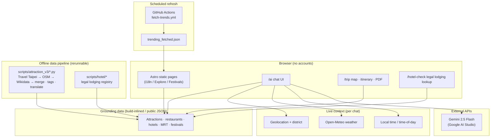

# Current website hosted <a href="https://gilded-naiad-6e9a75.netlify.app/">here</a>

# Taipei Compass · 台北指南針

> **EN** — A grounded, multilingual Taipei travel assistant that combines Taipei City open data with Gemini. It recommends real places only—no invented venues, with optional checks against the city’s legal hotel registry.  
> **中文** — 結合台北市開放資料與 Gemini 的多語旅遊助手；只推薦資料庫內真實存在的地點，並可對照合法旅宿登記，降低「AI 幻覺」與未登記住宿風險。

<p align="center">
  <a href="#overview">Overview 總覽</a> ·
  <a href="#supplementary-media">Docs &amp; media 文件與媒體</a> ·
  <a href="#walkthrough-narrative">Walkthrough 導覽稿</a> ·
  <a href="#features">Features 功能</a> ·
  <a href="#data-pipeline">Data pipeline 資料管線</a> ·
  <a href="#architecture">Architecture 架構</a> ·
  <a href="#design-themes">Design themes 設計主軸</a> ·
  <a href="#demo-smoke-test">Demo smoke test 演示自測</a> ·
  <a href="#faq">FAQ 常見問題</a> ·
  <a href="#project-layout">Layout 目錄結構</a> ·
  <a href="#run">Run 執行方式</a>
</p>

---

## Overview

**中文｜** 旅客用通用聊天機器人規劃台北時，常遇到三件事：**推薦的店不存在**、**短租／民宿無合法登記**、以及**無法結合即時天氣與實際位置**。台北指南針把 **756 個精選景點 × 8,269 間餐廳 × 619 家合法登記旅宿 × 121 個捷運站 × 18 個節慶**（來自政府與開放資料）當成模型的**唯一事實來源**，並在靜態、無帳號的四語網站中疊加**即時天氣**、**瀏覽器定位**與**旅宿登記編號**查核。

Travelers using general-purpose chatbots for Taipei often hit three issues: **places that do not exist**, **illegal or unregistered lodging**, and **no tie-in to live weather or where they actually are**.

Taipei Compass treats **756 curated attractions × 8,269 restaurants × 619 legally registered hotels × 121 MRT stations × 18 festivals**—sourced from government and open datasets—as the **only** ground truth for the model. It layers **live weather**, **browser geolocation**, and **Taipei’s legal lodging registry IDs** into a **static, account-free** site in four languages.

| Topic / 項目 | Figures / evidence · 數字／佐證 |
|------|---------------------|
| i18n 多語系 | EN / 繁中 / 日 / 韓，完整對等路由 |
| Restaurants 餐廳 | **8,269**（`public/data/restaurants.json`） |
| Attractions 景點 | **756** 於 `suggestion_level=3`（候選池 4,489） |
| Hotels 旅宿 | **619**，皆含觀光登記 `legal_id` |
| MRT 捷運 | **121** 站座標（含環狀線） |
| Festivals 節慶 | **18**，四語文案 |
| Build 建置 | `npm run build` → **38,714** 靜態 HTML（約 29s）；`dist/` 可離線演示 |
| AI grounding | 系統提示內嵌資料 + `<<PLACE:a/r/h:ID>>`；無效 ID 不渲染卡片 |
| Live context 即時情境 | Open-Meteo + 定位 + 本地時間，每回合注入 |
| Privacy 隱私 | 無帳號、無自有後端；偏好／行程／位置存 `localStorage` |
| Inclusion 包容性 | 長輩／親子／室內／平價等一級篩選 |
| Data ops 資料作業 | 六階段 Python：Travel Taipei → OSM → Wikidata → 合併 → 標籤 → 翻譯 |

**One-sentence try-it · 一句試用：** Ask the assistant (e.g. rainy weather + Shilin + indoor). It answers within a few hundred ms using **current weather, coarse location, and saved prefs**, returning only places in the database, each as a `<<PLACE>>` card you can add to `/trip`.  
**中文｜** 例如雨天、士林、室內景點——系統會在數百毫秒內依**天氣、粗略位置、已存偏好**回答，且每個推薦都是資料庫內可點的 `<<PLACE>>` 卡片，可一鍵加入 `/trip`。

---

## Supplementary media

**中文｜** 簡報 PDF、螢幕錄影等**選用**素材建議放在 [`docs/`](docs/)，與程式碼同一版本庫，方便審閱與重現。

Optional materials live under [`docs/`](docs/) so everything stays versioned with the code:

| Artifact | Typical path | Notes |
|----------|--------------|--------|
| Slide export 簡報匯出 | [`docs/final-selection.pdf`](docs/final-selection.pdf) | Rename or add parallel files as needed; update this table if paths change. 若改檔名請同步更新此表。 |
| Screen recording 螢幕錄影 | [`docs/demo-final.mp4`](docs/demo-final.mp4) | Large binaries often use Git LFS or GitHub Releases; keep a stable in-repo pointer here. 大型二進位檔可搭配 Git LFS 或 Release，README 仍保留可解析的連結。 |

---

## Features

### 1. Grounded AI assistant 落地 AI 助理

**Code · 程式：** `src/lib/ai.ts` · `src/pages/ai.astro` · `src/lib/weather.ts` · `src/lib/location.ts`

| Mechanism / 機制 | Where | Role / 作用 |
|-----------|--------|------|
| Data inlining 資料內嵌 | `buildSystemPrompt` | ~756 attractions + ~20 restaurants + ~12 hotels in system prompt 約 756 景點 + ~20 餐廳 + ~12 旅館 |
| `DISH_COVERAGE` | `coverageBlock` | Zero matches → must admit; no silent substitution 零筆須明說，不可偷換 |
| `<<PLACE:…>>` markers | Parser + UI | Verifiable cards; bad IDs fail visibly 可驗證卡片；錯 ID 即失效 |
| Weather 天氣 | `weather.ts` | Biases suggestions (e.g. indoor when wet) |
| Location 定位 | `location.ts` + 12 districts | “Near me” ~2.5 km + fallbacks |
| Time 時間 | `buildTimeContext` | Hours / time-of-day hints |
| History 歷史 | `localStorage` | Last ~20 turns |
| Trip context 行程 | `buildTripContext` | Skips stops already on `/trip` |
| Aliases 別名 | `CATEGORY_ALIASES`, `DISH_ALIASES` | Cross-language names 跨語系菜名 |

### 2. Safe Stay (lodging verification) 合法旅宿查核

**Code · 程式：** `src/pages/hotel-check.astro` · `src/data/hotels.json` · `src/lib/hotelData.ts`

- 619 rows / 619 筆，`legal_id` 對應台北旅宿登記
- Match zh/en name, address, legal ID／比對中英文名、地址、登記號
- Warning + nearby legal hotels when no match／無結果時警語 + 附近合法替代
- AI nudges users to `/hotel-check` for stays／住宿情境提示使用查核頁

### 3. Trip planner 行程規劃

**Code · 程式：** `src/pages/trip.astro`

- Leaflet + “Open route” to Google Maps
- Drag-and-drop schedule 拖拉式日程
- PDF export PDF 匯出
- All state in `localStorage` 狀態僅在瀏覽器

### 4. Trending dashboard 話題趨勢

**Code · 程式：** `src/components/trending.astro` · `src/data/trending_fetched.json` · `.github/workflows/fetch-trends.yml`

- Fetch every 6h UTC 02/08/14/20 每六小時更新
- Reddit/YouTube + static deep links for other networks
- Client reorder from saved interests 依偏好排序

### 5. Festivals 節慶

**Code · 程式：** `src/pages/festivals/*` · `src/data/festivals.json`

- Month index, four languages, links to places 月份索引、四語、連結代表景點

### 6. Explore 探索

**Code · 程式：** `src/pages/explore.astro`

- Attractions: district, category, inclusion tags 景點：行政區、分類、包容標籤
- Food: top subset, 43 cuisines × i18n, 16 districts × i18n 美食：高分子集、43 菜系、16 區

### 7. Home 首頁

**Code · 程式：** `src/components/home.astro`

- Random bento without prefs; scored with prefs 無偏好隨機；有偏好則重排
- “Near Me” within 4 km 四公里內鄰近景點

### 8. Preferences (no login) 偏好（免登入）

**Code · 程式：** `src/pages/prelog.astro`

- Chips for interests, districts, pace, trip length—shared across AI, home, trending, trip 興趣、行政區、步調、天數；全站共用

---

## Data pipeline

**中文｜** 六階段、可重跑、可斷點；管線本身不需付費 API 金鑰。

Six stages, rerunnable, resumable, no paid keys required for the pipeline itself:

```
scripts/attraction_v3/
├── 01_travel_taipei.py    # Travel Taipei Open API (zh + en)
├── 02_osm_overpass.py     # OSM Overpass: five classes + Wikidata QIDs
├── 03_wikidata_enrich.py  # Labels, websites, CC0 images
├── 04_merge_dedupe.py     # Merge, ~500 m dedupe, QID merges
├── 05_tag_rules.py        # Rule-based tags (no LLM cost)
├── 06_integrate.py        # Frontend schema, stable IDs
├── 07_translate.py        # Free translate endpoint + cache
└── 08_apply_translations.py
```

```
scripts/hotel/
└── taipei_travel_hotels_enriched_with_stars.json  # 619 legal hotels + 25 official star ratings
```

**Licensing · 授權：** Travel Taipei（政府開放資料）, OSM（ODbL, attributed）, Wikidata（CC0）, Open-Meteo（CC BY 4.0, no key）.

---

## Internationalization

**中文｜** 四語完整對應路由，`Layout.astro` 切換語系、品牌與導覽。

| Language | Entry | Source folder |
|----------|--------|----------------|
| English 英文 | `/` | `src/pages/` (root) |
| Traditional Chinese 繁體中文 | `/zh` | `src/pages/zh/` |
| Japanese 日本語 | `/jp` | `src/pages/jp/` |
| Korean 한국어 | `/kr` | `src/pages/kr/` |

Each locale mirrors core routes: `index`, `ai`, `explore`, `hotels`, `hotel-check`, `trending`, `festivals`, `trip`, `prelog`, `profile`, `place/*`—**40+** routes total. `Layout.astro` switches `htmlLang`, branding, and nav.

---

## Privacy and inclusion

**中文｜** 靜態站、定位不出站、偏好與行程留在裝置；旅宿查核與包容篩選為一等公民。

| Design | Why it matters |
|--------|----------------|
| Static site, no accounts 靜態、無帳號 | Minimal data collection 最少蒐集 |
| Geolocation in browser 定位在瀏覽器 | Not uploaded to first-party server 不上傳自有伺服器 |
| Prefs / trip / chat in `localStorage` | User-controlled lifecycle 使用者可清除 |
| Senior/kid/budget/indoor filters 長輩／親子／價位／室內 | Accessibility-oriented 無障礙導向 |
| Price cues 價格提示 | Transparent expectations 期待透明 |
| Legal lodging verification 合法旅宿 | Consumer protection 消費者保護 |
| Full-route i18n 全路由多語 | Not “English-only + translated landing” 非只翻譯首頁 |

---

## Tech stack

**中文｜** Astro 靜態輸出、`dist/` 可直接離線開啟，利於審閱與備份。

```
Astro 6.1.9 (SSG, full prerender)
├── Tailwind CSS 4.2.2 (@tailwindcss/vite)
├── TypeScript (strict lib/)
├── Vanilla JS (no React/Vue in the hot path)
├── Gemini 2.5 Flash (Google AI Studio v1beta)
├── Open-Meteo (weather, no API key)
├── Leaflet (maps)
└── GitHub Actions (scheduled data refresh)
```

**Why Astro · 為何 Astro：** static HTML from `dist/` without a Node server—handy for reviews and offline archives 無需 Node 伺服器即可打開產物。

---

## Architecture



---

## FAQ

### Reliability 可靠性

**Does the model still hallucinate?** Three gates: `markerRule` + inlined ID lists + UI dropping bad markers; `DISH_COVERAGE` for dish honesty.  
**中文｜** 三道防線：`markerRule`、`<<PLACE>>` 與清單內 ID、UI 不渲染無效 marker；菜色覆蓋率強制誠實。

**Why Gemini?** Thinking budget, free tier for demos, simple `fetch`; swap models via `askGemini`.  
**中文｜** 可控思考預算、演示友善、易替換實作。

**Token budget?** `filterRestaurants` → ~20; compact attraction projection ~30k system tokens.  
**中文｜** 餐廳先篩再進 prompt；景點做精簡投影。

**Why Astro over Next?** Static prerender, minimal JS, open `dist/index.html` directly.  
**中文｜** 內容多為靜態、預渲染 HTML、利離線與審閱。

### Data 資料

**Lodging freshness?** 619 registry rows; 25 with stars; rerun hotel scripts to refresh.  
**中文｜** 619 筆登記資料；25 筆星等；可重跑腳本更新。

**Translations?** Public translate endpoint + cache + MyMemory fallback.  
**中文｜** 公開翻譯端點 + 快取 + 備援。

**Update cadence?** Rerun `attraction_v3/` for POI JSON; Actions every 6h for trending; weather/location per session.  
**中文｜** 景點／餐廳／旅宿靠管線重跑；趨勢靠 Actions；天氣定位每會話更新。

### Positioning 定位

**vs. general chatbots:** Grounded to audited Taipei data, lodging checks, live context, inclusive filters, full i18n.  
**中文｜** 與通用助手差在：資料邊界、旅宿查核、即時情境、包容篩選、四語對等路由。

**Why not vector RAG yet?** Deterministic filter + inline subsets at this scale; vector RAG if POI count jumps.  
**中文｜** 現階段規模以規則篩選 + 內嵌子集較快且可稽核。

### Inclusion and privacy 包容與隱私

**Older adults?** Senior labels in primary nav; `clamp` typography; printable map/PDF.  
**中文｜** 長輩標籤在一級導覽；字級自適應；可列印。

**Privacy?** No Taipei Compass backend; Gemini/Open-Meteo from browser; clear storage to wipe.  
**中文｜** 無自有後端；清除儲存即清除本地狀態；座標不上傳自有伺服器。

### Business and scale 商業與規模

**Monetization:** White-label, government partnerships, multi-city licensing, labeled sponsorships.  
**中文｜** 白牌、政府合作、多城市授權、透明標示之贊助排序等。

**Scaling risks:** Translation throughput, Gemini limits, data licensing for commercial use.  
**中文｜** 翻譯流量、模型配額、商用資料授權。

### Operations 維運

**Why JSON in git?** Static build input; auditable diffs; no public DB.  
**中文｜** 建置需要；diff 可追蹤；免營運資料庫。

**If Gemini is down:** Retries + errors; browse/trip/hotel check/festivals/trending still work.  
**中文｜** 重試與錯誤提示；非 AI 功能仍可獨立使用。

---

## Project layout

**中文｜** 精簡目錄導覽；細節以實際 repo 為準。

```
ytp_3/
├── README.md
├── docs/                       # Optional PDFs, recordings, diagrams · 選用簡報／錄影／圖檔
├── astro.config.mjs
├── package.json
├── run.bat                     # Windows helper
├── LICENSE
│
├── src/
│   ├── pages/                  # Astro × 4 locales
│   │   ├── index.astro / ai.astro / explore.astro / trending.astro
│   │   ├── hotels.astro / hotel-check.astro / hotel/[id].astro
│   │   ├── trip.astro / prelog.astro / profile.astro
│   │   ├── festivals/{index,[slug]}.astro
│   │   ├── place/{a,r}/[id].astro
│   │   ├── zh/, jp/, kr/
│   │   └── admin/generate-captions.astro
│   ├── components/
│   ├── layouts/Layout.astro
│   ├── lib/
│   │   ├── ai.ts
│   │   ├── hotelData.ts
│   │   ├── location.ts
│   │   └── weather.ts
│   ├── data/
│   └── styles/global.css
│
├── public/
│   ├── data/restaurants.json
│   ├── images/
│   └── favicon.svg
│
├── scripts/
│   ├── attraction_v3/
│   ├── hotel/
│   ├── pages/
│   └── debug_friendly/
│
└── .github/workflows/
    ├── build.yml
    └── fetch-trends.yml
```

---

## Run

**Requirements · 需求：** Node.js **22.12+** (`package.json` engines), npm or pnpm.

```bash
git clone <repo>
cd ytp_3
npm install
# Set PUBLIC_GEMINI_API_KEY in .env (https://aistudio.google.com)
npm run dev    # http://localhost:4321
```

**Windows · Windows：** double-click `run.bat` (portable Node path hints).

```bash
npm run build    # output: dist/ (static HTML, any static host)
npm run preview  # local preview of dist/
```

**Environment · 環境變數：**

```dotenv
PUBLIC_GEMINI_API_KEY=xxxxx
```

Set `ASTRO_TELEMETRY_DISABLED=1` if telemetry fails in locked-down environments. On Windows PowerShell, if `npm` is blocked by execution policy, call `npm.cmd`.  
**中文｜** 受限環境可關閉 Astro 遙測；PowerShell 執行原則阻擋時改用 `npm.cmd`。

---

## License and credits

**Data · 資料來源**

- Taipei City Department of Information and Tourism — [Travel Taipei Open API](https://www.travel.taipei/open-api/) 臺北市政府觀光傳播局
- Taipei legal lodging registry 臺北市觀光署合法旅宿登記
- [OpenStreetMap](https://www.openstreetmap.org/) (© contributors, ODbL)
- [Wikidata](https://www.wikidata.org/) (CC0)
- [Open-Meteo](https://open-meteo.com/) (CC BY 4.0)
- Taipei Metro station reference data 臺北捷運站點資料

**Stack · 技術：** [Astro](https://astro.build/) · [Tailwind CSS](https://tailwindcss.com/) · [Google Gemini](https://ai.google.dev/) · [Leaflet](https://leafletjs.com/)

**Fonts · 字體：** Noto Serif TC / Noto Sans TC / Material Symbols

---

<p align="center">
  <strong>EN — Ground travel help in open data—then let travelers choose.</strong><br>
  <strong>中文 — 用開放資料把旅遊建議鎖在事實裡，把選擇權留給旅人。</strong><br>
  <em>Taipei Compass / 台北指南針 keeps the model inside the city’s facts.</em>
</p>
